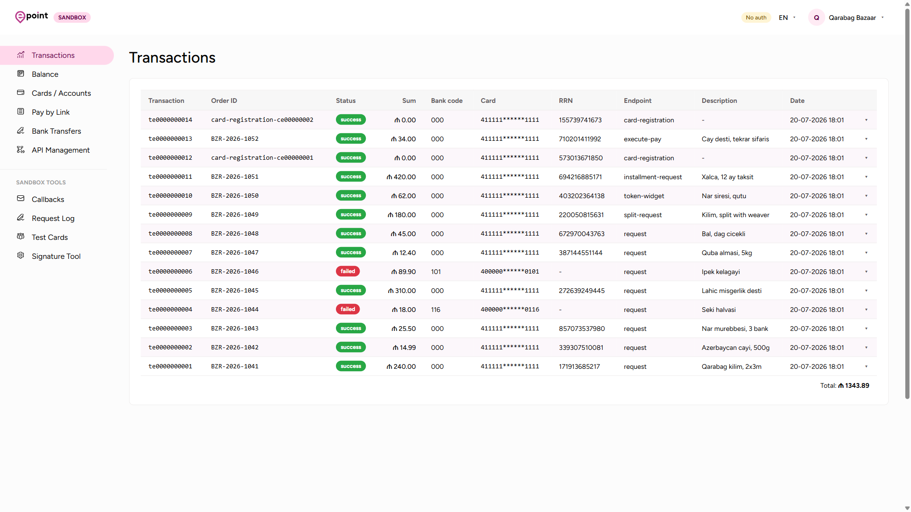
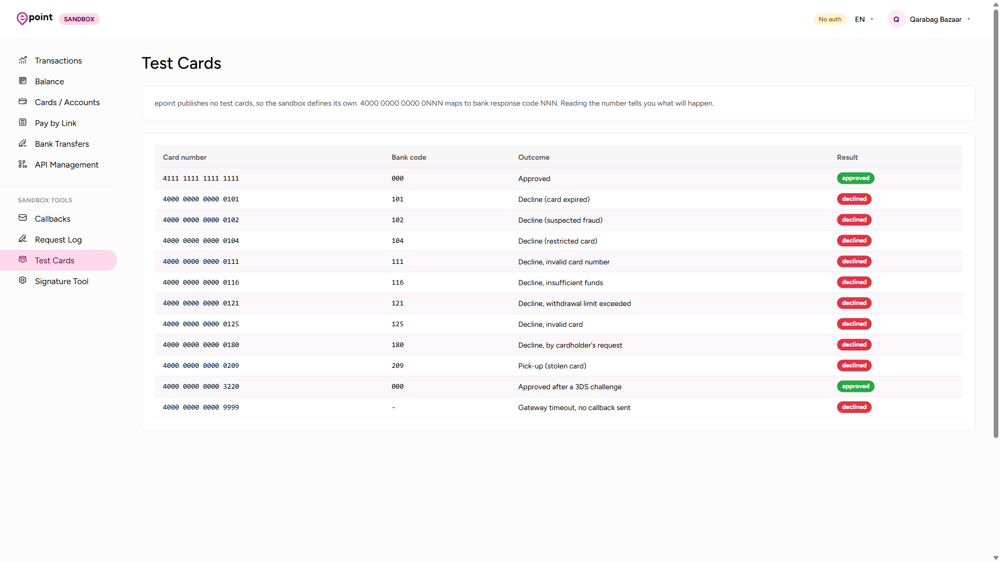
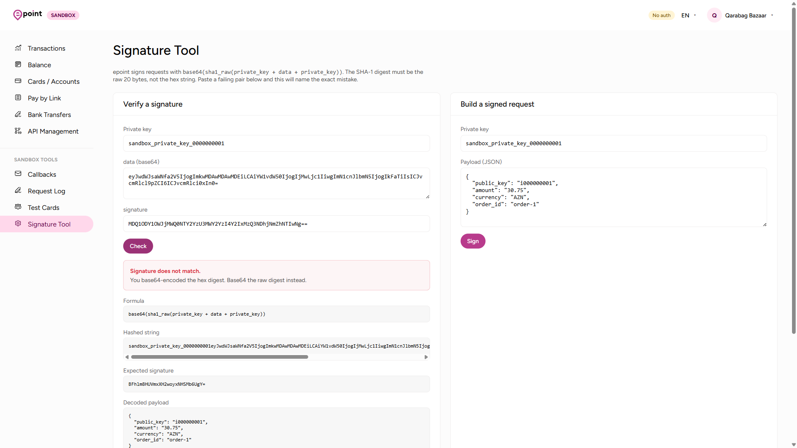
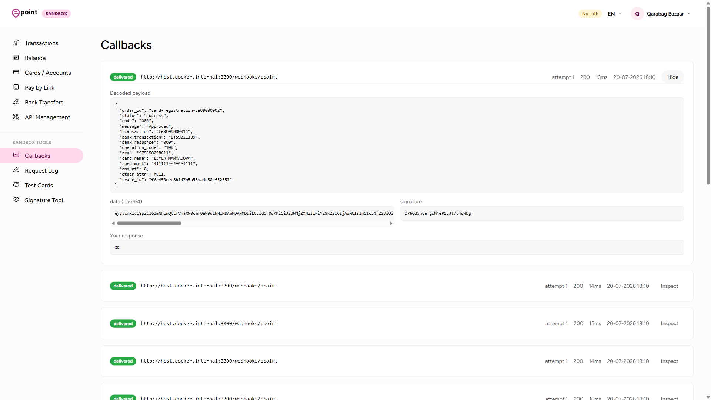
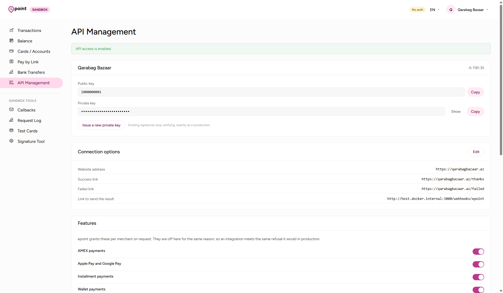
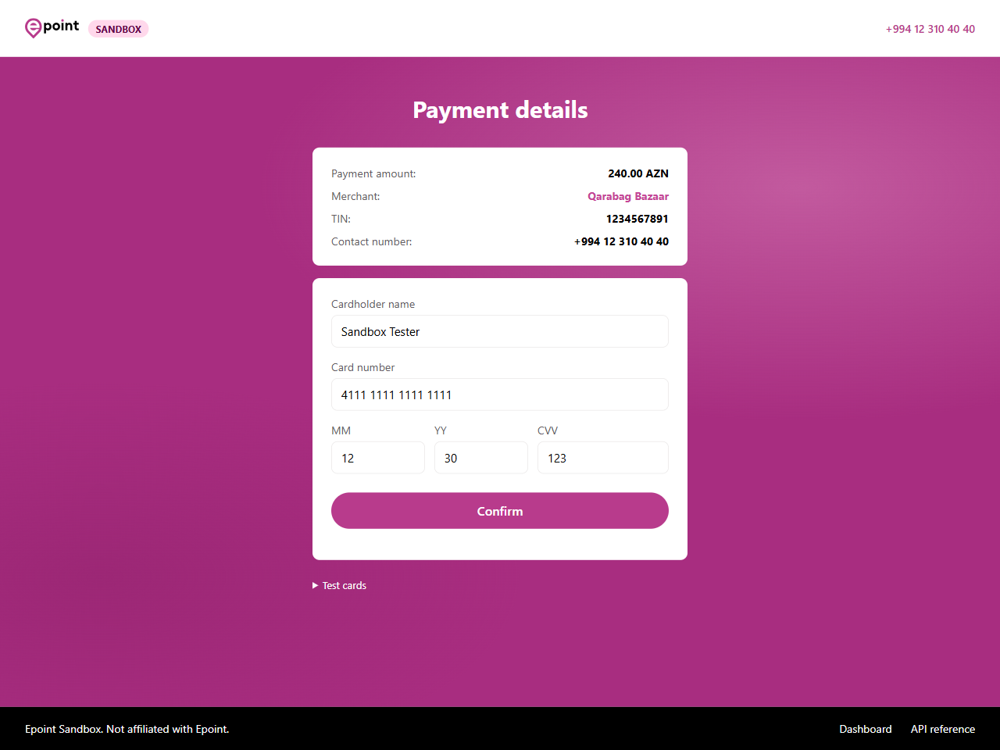
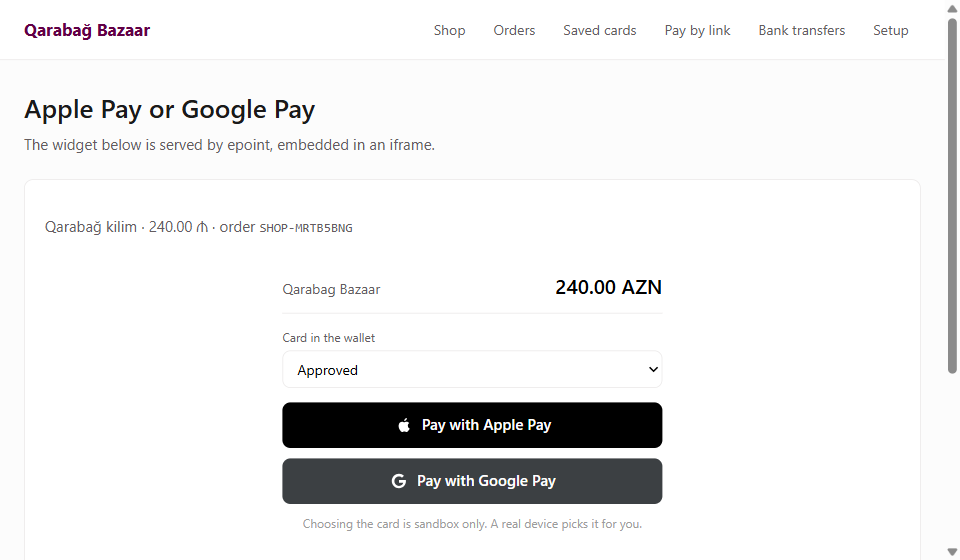

**Azərbaycanca** · [English](README.en.md)

# Epoint Sandbox

[epoint.az](https://epoint.az) ödəniş gateway-inin lokal versiyası. Merchant hesabı olmadan
inteqrasiyanızı qurub test edə bilərsiniz.

```bash
docker run -p 8181:8181 ghcr.io/martian56/epoint-sandbox
```

Postgres konteynerin içindədir, migration-lar başlanğıcda özü işləyir. Təxminən 15 saniyəyə hazır
olur.

İnteqrasiyanızı bura yönləndirin:

```
https://epoint.az/api/1/request   ->   http://localhost:8181/api/1/request
```

`/api/1/` altındakı bütün path-lər production ilə eynidir, ona görə başqa heç nə dəyişmir.



| URL | |
|---|---|
| `http://localhost:8181` | Dashboard |
| `http://localhost:8181/api/1/*` | Epoint ilə uyğun API |
| `http://localhost:8181/checkout/{token}` | Ödəniş səhifəsi |
| `http://localhost:8181/docs` | OpenAPI sxemi |

## İmkanlar

**Hər ödəniş göz önündədir.** Dashboard epoint-in kabinetinin surətidir, ona görə burada
öyrəndikləriniz prod-da da işə yarayır. Əməliyyatlar, real balans tarixçəsi, yadda saxlanmış
kartlar, invoice-lar, bank köçürmələri, üstəlik production-da qarşılığı olmayan request log və
callback izləyicisi.

**Səhvləri özünüz yaradırsınız.** Epoint test kartları paylaşmır, ona görə sandbox öz kartlarını
təyin edir. Son üç rəqəm bank cavab kodudur, yəni nömrəyə baxıb nəticəni bilirsiniz. Uğursuz
ödənişi, ya da callback-in heç vaxt gəlmədiyi timeout halını yoxlamaq üçün sadəcə başqa nömrə
yazın.



**İmza səhvi birbaşa deyilir.** Epoint `base64(sha1_raw(private_key + data + private_key))` ilə
imzalayır və digest hex string yox, xam 20 bayt olmalıdır. İnteqrasiyaların əksəriyyəti məhz burada
uğursuz olur. İşləməyən `data` və `signature` cütünü yapışdırın, alət hansı səhvi etdiyinizi deyir.



**Callback-ləri həqiqətən görürsünüz.** Sandbox sizin `result_url` ünvanınıza production-un
göndərdiyi eyni imzalanmış payload-u göndərir. Hər cəhd qeyd olunur: açılmış payload, xam `data`,
imza və sizin öz cavabınız. Beləcə səssizcə 500 qaytaran webhook gizli qalmır.



**Açarlar və icazələr sizdədir.** Private key-i yeniləyin, köhnə imzalar dərhal işləməyi dayandırır,
tam production-dakı kimi. AMEX, Apple Pay, Google Pay, taksit, wallet və B2B default olaraq
bağlıdır, çünki epoint bunları hər merchant üçün ayrıca, sorğu əsasında açır. Yəni inteqrasiyanız
burada da prod-dakı eyni imtina ilə qarşılaşır.



**Ödəniş səhifəsi**, müştərinin əslində ödəniş etdiyi yer.



**Apple Pay və Google Pay**, redirect yox, embed etdiyiniz widget kimi işləyir və nəticəni
production-dakı kimi `postMessage` ilə qaytarır.



## Lokal iş

İki hesab hazır gəlir, ona görə split ödənişlər dərhal işləyir:

| | Public key | Private key |
|---|---|---|
| Sandbox Merchant | `i000000001` | `sandbox_private_key_0000000001` |
| Split Partner | `i000000002` | `sandbox_private_key_0000000002` |

Yaxud **API Idarəetmə** səhifəsində özünüzünkünü yaradın: veb sayt, uğurlu, uğursuz və nəticə
linklərini yazın, sonra açar cütünü götürün. Açarlar epoint formatındadır, `i` və doqquz rəqəm,
plus 24 simvolluq secret. Yəni formatı yoxlayan kod prod-da da işləməyə davam edir.

Adi iş axını:

```bash
docker run -d -p 8181:8181 --name epoint \
  --add-host=host.docker.internal:host-gateway \
  ghcr.io/martian56/epoint-sandbox
```

`result_url` ünvanını öz maşınınıza yönləndirin. Callback-lər konteynerin içindən gedir, ona görə
oradakı `localhost` sizin kompüteriniz yox, konteynerin özüdür:

```bash
curl -X PATCH http://localhost:8181/_sandbox/merchants/i000000001 \
  -H "Content-Type: application/json" \
  -d '{"result_url": "http://host.docker.internal:3000/webhooks/epoint"}'
```

Sonra ödənişi işə salın: `/api/1/request` ünvanına POST edin, qayıdan `redirect_url` ünvanına
yönləndirin, `4111 1111 1111 1111` ilə ödəyin və callback-in gəlişini izləyin. Nəsə alınmasa,
Request Log səhifəsində xam `data`, imza və imzanın doğrulanıb-doğrulanmadığı var. Callbacks
səhifəsində isə hər göndərmə cəhdi sizin cavabınızla birlikdə görünür.

Lokalda login yoxdur. Volume qoşmasanız, hər restart-da baza təmiz başlayır.

## Test kartları

Son üç rəqəm bank cavab kodudur.

| Kart | Nəticə |
|---|---|
| `4111 1111 1111 1111` | Uğurlu (`000`) |
| `4000 0000 0000 0116` | Vəsait kifayət etmir (`116`) |
| `4000 0000 0000 0101` | Kartın müddəti bitib (`101`) |
| `4000 0000 0000 0102` | Fırıldaqçılıq şübhəsi (`102`) |
| `4000 0000 0000 0209` | Oğurlanmış kart (`209`) |
| `4000 0000 0000 3220` | 3DS təsdiqindən sonra uğurlu |
| `4000 0000 0000 9999` | Gateway timeout, callback ümumiyyətlə gəlmir |

Gələcək tarixli istənilən müddət və istənilən CVV işləyir. Tam siyahı: `GET /_sandbox/cards`.

## Callback-lər

Sandbox sizin `result_url` ünvanınıza production-un göndərdiyi eyni `data` və `signature` cütünü
göndərir. API Idarəetmə səhifəsindən, ya da API ilə təyin edin:

```bash
curl -X PATCH http://localhost:8181/_sandbox/merchants/i000000001 \
  -H "Content-Type: application/json" \
  -d '{"result_url": "http://host.docker.internal:3000/webhooks/epoint"}'
```

Callback-lər konteynerin içindən gedir, ona görə oradakı `localhost` sizin maşınınız deyil.
`host.docker.internal` istifadə edin. Linux-da bu host-u əlavə etmək lazımdır:

```bash
docker run -p 8181:8181 --add-host=host.docker.internal:host-gateway \
  ghcr.io/martian56/epoint-sandbox
```

## İmzalar

Epoint `base64(sha1_raw(private_key + data + private_key))` ilə imzalayır. Digest hex string yox,
xam 20 bayt olmalıdır. İnteqrasiyaların çoxu məhz burada səhv edir.

```python
import base64, hashlib
signature = base64.b64encode(
    hashlib.sha1(f"{private_key}{data}{private_key}".encode()).digest()
).decode()
```

Signature Tool səhifəsi işləməyən cütü götürüb səhvin nə olduğunu deyir.

## Endpoint-lər

Sənədləşdirilmiş 30 endpoint-in hamısı var.

| Sahə | Endpoint-lər |
|---|---|
| Ödəniş | `request`, `checkout`, `payment-request`, `amex-request`, `payment-change-sum` |
| Split | `split-request`, `split-execute-pay` |
| Pre-auth | `pre-auth-request`, `pre-auth-complete` |
| Kartlar | `card-registration`, `card-registration-with-pay`, `execute-pay`, `get-status-card` |
| Vəsait | `refund-request` (geri qaytarma və payout), `reverse` |
| Status | `get-status` |
| Invoice | `create`, `update`, `view`, `list`, `send-sms`, `send-email` |
| Taksit | `get-installment-request`, `installment-request` |
| Wallet | `wallet/status`, `wallet/payment` |
| Token | `token/widget` |
| B2B | `b2b/payment`, `b2b/payment/{order_id}` |
| Health | `heartbeat` |

### Apple Pay və Google Pay

İkisi də `token/widget` üzərindən işləyir. Bu endpoint `widget_url` qaytarır, siz onu redirect
etmirsiniz, embed edirsiniz. Bir widget hər iki wallet-ə xidmət edir, hansı düyməni göstərməyi
cihaz özü seçir.

```html
<iframe src="{widget_url}" width="100%" height="330"></iframe>
```

Nəticə redirect kimi yox, iframe-i saxlayan səhifəyə `postMessage` kimi gəlir:

```js
window.addEventListener('message', (event) => {
  // { status: 'success', payment: { order_id, transaction, card_mask, ... } }
})
```

`result_url` ünvanınıza gedən imzalanmış callback yenə də göndərilir və sifarişi məhz onunla
bağlamaq lazımdır. Sandbox widget-inin içində wallet-dəki kartı seçə bilirsiniz, ona görə uğursuz
halları da yoxlamaq mümkündür.

Balanslar real tarixçədir: ödənişlər balansı artırır, komissiya və geri qaytarmalar azaldır, split
isə hesablar arasında bölünür. Invoice SMS və email-ləri göndərilmir, dashboard-da saxlanılır.

AMEX, Apple Pay, Google Pay, taksit, wallet və B2B default olaraq bağlıdır, çünki epoint bunları
hər merchant üçün ayrıca açır. API Idarəetmə səhifəsindən aça bilərsiniz.

Hər cavabda `X-Epoint-Sandbox: 1` header-i olur. Production smoke test-lərinizdə bu header-in
**olmadığını** yoxlayın.

## Konfiqurasiya

| Dəyişən | |
|---|---|
| `EPOINT_DATABASE_URL` | Daxili Postgres yerinə öz baza serverinizi işlədin |
| `EPOINT_PUBLIC_BASE_URL` | Qaytarılan `redirect_url` üçün baza ünvan, default `http://localhost:8181` |
| `EPOINT_ADMIN_EMAIL` / `EPOINT_ADMIN_PASSWORD` | İkisini də təyin etsəniz, dashboard login tələb edir. Boş qalsa, açıqdır. |
| `EPOINT_SESSION_TTL_HOURS` | Dashboard sessiyasının müddəti, default `12` |
| `EPOINT_COMMISSION_RATE` | Ödənişdən tutulan komissiya, default `0.03` |
| `EPOINT_SEED_MERCHANTS` | `false` etsəniz, heç bir hazır hesab olmur |

Daxili bazanın datası `/var/lib/postgresql/data` altındadır. Konteynerlər arasında saxlamaq üçün ora
volume qoşun.

## Staging

Eyni konteyner staging mühitinizin yanında ortaq servis kimi işləyir. Admin parolu təyin etsəniz,
dashboard login tələb edir.

```yaml
services:
  epoint-sandbox:
    image: ghcr.io/martian56/epoint-sandbox:0.2.0
    environment:
      EPOINT_ADMIN_EMAIL: admin@example.com
      EPOINT_ADMIN_PASSWORD: ${EPOINT_ADMIN_PASSWORD}
      EPOINT_PUBLIC_BASE_URL: https://epoint-sandbox.staging.internal
      EPOINT_DATABASE_URL: postgresql+psycopg://epoint:epoint@db:5432/epoint_sandbox
    ports: ['8181:8181']
```

Lokaldan üç fərqi var.

**Servisləriniz ona konteyner adı ilə çatır.** `result_url`
`http://your-api:3000/webhooks/epoint` olur, `host.docker.internal` lazım deyil.

**`EPOINT_PUBLIC_BASE_URL` mütləq təyin olunmalıdır.** API-nin qaytardığı `redirect_url` ondan
qurulur. Default qalsa, müştəriləriniz `localhost` ünvanına yönlənəcək.

**Hazır hesabların açarları generasiya olunur.** Yuxarıdakı cədvəldəki açarlar public image-in
içindədir, ona görə parol qoyulmuş instansiya təsadüfi açarlar verir. Public key-lər `i000000001` və
`i000000002` olaraq qalır ki, split ödənişlər işləməyə davam etsin, amma secret-lər yalnız sizin
deployment-ə aiddir. İlk login-dən sonra API Idarəetmə səhifəsindən götürün.

Bu vacibdir: login yalnız dashboard-u və `/_sandbox/*` ünvanlarını qoruyur, `/api/1/*` isə ancaq
imza ilə qorunur. Əgər açarlar public qalsaydı, sandbox-a çıxışı olan hər kəs düzgün imzalanmış
sorğu göndərib staging sisteminizə saxta ödəniş callback-ləri ata bilərdi.

### Login

Məlumatlar ilk açılış ekranından yox, başlanğıcda environment-dən oxunur. Ona görə deploy-dan sonra
instansiyanın sahibsiz qaldığı və kiminsə onu ələ keçirə biləcəyi bir aralıq yaranmır.

Skriptlər sessiya cookie-si yerinə parolu bearer token kimi işlədir:

```bash
curl https://epoint-sandbox.staging.internal/_sandbox/merchants \
  -H "Authorization: Bearer $EPOINT_ADMIN_PASSWORD"
```

Sessiyalar `EPOINT_SESSION_TTL_HOURS` qədər, default 12 saat yaşayır və açarları məlumatlardan
törəyir, yəni parolu dəyişəndə hamı avtomatik çıxır.

`/_sandbox/health` açıq qalır ki, konteyner health check-ləri parolsuz işləsin.

## Təhlükəsizlik

`/api/1/*` heç vaxt admin parolu ilə bağlanmır. O onsuz da imza ilə qorunur və üstünə ikinci qat
əlavə etmək "yalnız base URL və açarlar dəyişir" vədini pozardı. Onu qorumağın yolu sandbox-u
etibarsız şəbəkələrdən uzaq saxlamaqdır, ikinci qat əlavə etmək yox.

Admin parolu təyin olunmayıbsa, heç bir autentifikasiya yoxdur: dashboard açıqdır və
`GET /_sandbox/merchants` private key-ləri açıq mətnlə qaytarır. Bu halda dashboard-un yuxarısında
**No auth** nişanı görünür. `localhost` üçün normaldır, başqa yer üçün yox.

Sandbox-u heç bir halda açıq internetə çıxarmayın. Real pul saxlamır, amma callback URL-lərinizi və
staging host adlarınızı hər kəsə göstərəcək.

## Töhfə vermək

[bun](https://bun.sh) və [uv](https://docs.astral.sh/uv/) lazımdır.

```bash
bun install
docker compose up -d
cd apps/api && uv sync && uv run alembic upgrade head && cd ../..

bun run dev:api    # API 8181-də
bun run dev:web    # dashboard 5173-də
```

`bun run check` CI-nin etdiyi hər şeyi işlədir. `design-tokens.json` faylını dəyişdikdən sonra
`bun run tokens` ilə design token-ləri yenidən yaradın.

## Epoint ilə bağlı deyil

Bu, epoint.az ilə inteqrasiya edən developer-lər üçün müstəqil alətdir. Brendi yox, API
kontraktını təqlid edir və real ödəniş emal etmir.

MIT lisenziyası.
